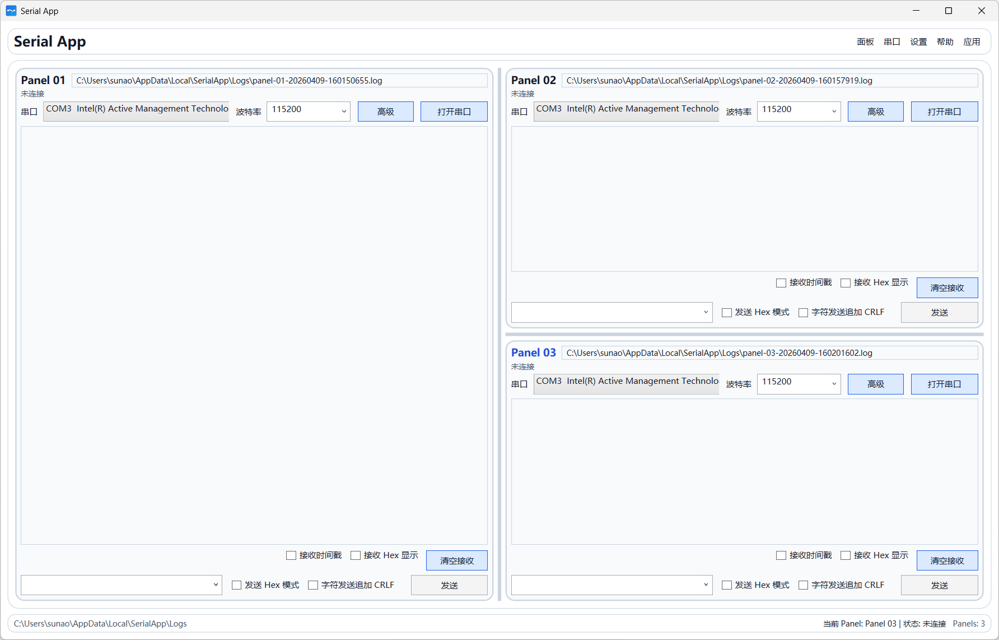

# SerialApp.Desktop

一个基于 WPF 的多窗口串口通信终端应用程序，支持灵活的分屏布局和多串口并发操作。



## 功能特性

- **多 Panel 布局**：支持水平和垂直分屏，可同时操作多个串口
- **实时串口通信**：支持文本和 Hex 模式收发数据
- **独立日志记录**：每个 Panel 生成独立的日志文件
- **设备热插拔检测**：自动检测串口设备的插入和移除
- **发送历史记录**：保存最近 16 条发送记录，多 Panel 共享
- **灵活的波特率配置**：支持自定义数据位、停止位、校验位

## 技术栈

- **框架**：.NET 10.0 with WPF
- **语言**：C#
- **架构模式**：MVVM
- **主要依赖**：
  - System.IO.Ports (10.0.5)
  - System.Management (10.0.0)

## 项目结构

```
SerialApp.Desktop/
├── App.xaml                 # 应用程序入口和全局异常处理
├── MainWindow.xaml          # 主窗口 UI 定义
├── ViewModels/
│   ├── MainWindowViewModel  # 主窗口视图模型
│   ├── SerialPanelViewModel # 串口 Panel 视图模型
│   ├── SplitPanelNodeViewModel # 分屏布局视图模型
│   └── ViewModelBase        # 视图模型基类
├── Models/
│   ├── SerialPortOption     # 串口配置选项
│   ├── SerialPortSettings   # 串口参数设置
│   └── AppPreferences       # 应用首选项
├── Services/
│   ├── SerialPortCatalogService  # 串口设备目录服务
│   ├── SerialPortSession         # 串口会话管理
│   ├── PanelLogWriter            # 日志写入服务
│   └── AppStateService           # 应用状态管理
└── Docs/
    └── UserGuide.txt        # 用户使用说明
```

## 运行环境

- **操作系统**：Windows 10/11
- **.NET 版本**：.NET 10.0
- **硬件要求**：需要可用的串口（物理或虚拟）

## 构建和运行

```bash
# 还原依赖
dotnet restore

# 构建项目
dotnet build

# 运行应用
dotnet run
```

## 使用说明

### 基本操作

1. 启动应用后，默认显示一个串口 Panel
2. 选择串口号、波特率等参数
3. 点击"打开串口"建立连接
4. 在接收区查看数据，在发送区输入并发送数据

### 分屏操作

- **向右分屏**：菜单 → 面板 → 在右侧新增
- **向下分屏**：菜单 → 面板 → 在下方新增
- **关闭 Panel**：菜单 → 面板 → 关闭当前

### 日志管理

- 默认日志目录：`%LocalAppData%/SerialApp/Logs`
- 双击日志路径可用记事本打开
- 可通过菜单自定义日志目录

## 配置文件

- **应用配置**：`%LocalAppData%/SerialApp/settings.json`
- **启动日志**：`%LocalAppData%/SerialApp/startup.log`

## 状态说明

| 状态 | 说明 |
|------|------|
| 未连接 | 尚未打开串口 |
| 已连接 | 已成功连接串口 |
| 打开失败 | 串口打开失败，请检查参数或占用 |
| 发送失败 | 发送时发生错误 |
| 串口错误 | 串口通信异常 |
| 未连接（COMx 已移除） | 串口设备已拔出 |
| 接收缓存拥塞 | 接收速度过快，出现丢包保护 |

## 许可证

本项目仅供学习和开发使用。
